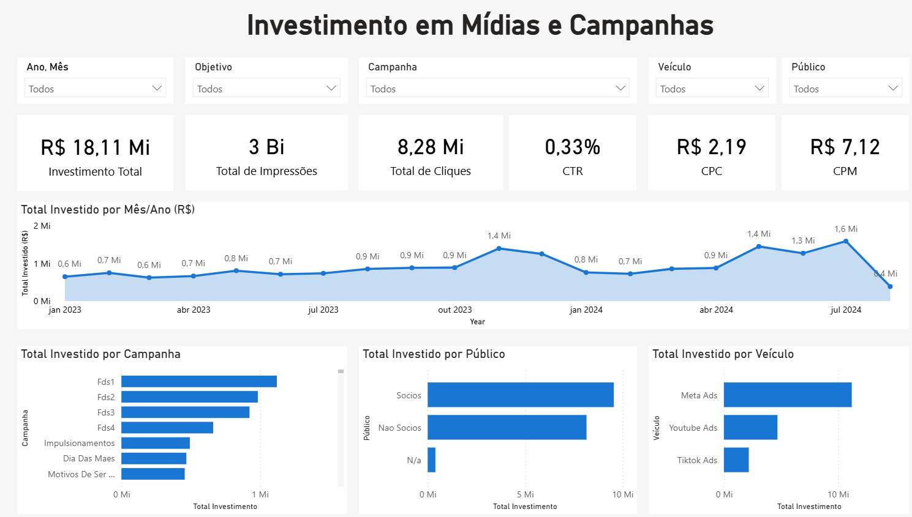

# 📊 Power BI Dashboard — Investimento em Mídias e Campanhas

Dashboard interativo desenvolvido no **Power BI Desktop** para análise integrada de **investimentos em mídia paga**, com foco em eficiência, distribuição e desempenho de campanhas em diferentes plataformas digitais (Meta Ads, TikTok Ads e YouTube Ads).

---

## 🎯 Objetivo

O objetivo deste dashboard é oferecer uma visão consolidada sobre **como os recursos de marketing digital estão sendo aplicados**, permitindo identificar:

- O comportamento mensal dos investimentos  
- A eficiência de cada plataforma (CTR, CPC, CPM)  
- As campanhas e públicos com maior volume de investimento  
- A distribuição do orçamento por canal e período  

---

## 🧩 Principais Indicadores (KPIs)

| KPI | Descrição | Interpretação |
|------|------------|----------------|
| **R$ 18.11M** | **Investimento Total** | Valor total aplicado em campanhas de mídia paga |
| **3bn** | **Total de Impressões** | Quantidade total de exibições dos anúncios |
| **8.28M** | **Total de Cliques** | Número total de interações geradas |
| **0.33%** | **CTR (Click Through Rate)** | Taxa de cliques sobre impressões — mede o engajamento médio |
| **R$ 2.19** | **CPC (Cost per Click)** | Custo médio pago por clique |
| **R$ 7.12** | **CPM (Cost per Mille)** | Custo médio para mil impressões |

---

## 📈 Visualizações Principais

| Visão | Descrição |
|--------|------------|
| **Total Investido por Mês/Ano (R$)** | Evolução mensal do investimento ao longo do período |
| **Total Investido por Campanha** | Distribuição de valores entre campanhas |
| **Total Investido por Público** | Comparativo entre Sócios e Não-Sócios |
| **Total Investido por Veículo** | Distribuição entre Meta Ads, TikTok Ads e YouTube Ads |

---

## 🖼️ Preview do Dashboard



> *Exemplo de visão geral do relatório com indicadores de investimento, CTR, CPC e CPM.*

---

## 🧱 Estrutura do Repositório

```
📂 powerbi-investimentos-midias/
│
├── 📄 README.md
├── 📄 LICENSE.txt
├── 📁 report/
│ └── dashboard_investimentos.pbix
├── 📁 data/
│ └── BASE_DE_PACING_v2.csv
├── 📁 images/
│ └── dashboard_overview.png
| └── KPIs_principais.png
├── 📁 docs/
│ └── Relatório Desempenho de Campanhas – 2023 e 2024.pdf
```

---

## 🔗 Versão Online

O dashboard interativo está disponível para visualização no Power Apps / Power BI Service:

👉 [Acesse o dashboard publicado](https://app.powerbi.com/view?r=eyJrIjoiMmRlZDhjOGYtNGI2YS00YjhjLWE4MjctYjI4NGNjODE4ZjBjIiwidCI6IjY1OWNlMmI4LTA3MTQtNDE5OC04YzM4LWRjOWI2MGFhYmI1NyJ9)

---

## 🧠 Tecnologias Utilizadas

- **Power BI Desktop**
- **Power Query (M)** para tratamento e transformação de dados  
- **DAX** para criação de medidas e cálculos de KPIs  
- **Power BI Service / Power Apps** para publicação e compartilhamento  
- **Excel/CSV** como fonte de dados  

---

## 👤 Autor

**Doglas Parise, PhD**  
Analista de Dados  
📧 [doglasparise@gmail.com](mailto:doglasparise@gmail.com)  
🌐 [LinkedIn](https://www.linkedin.com/in/doglas-parise/)

---

## 🪪 Licença

Este projeto é distribuído sob a [Licença MIT](LICENSE).
